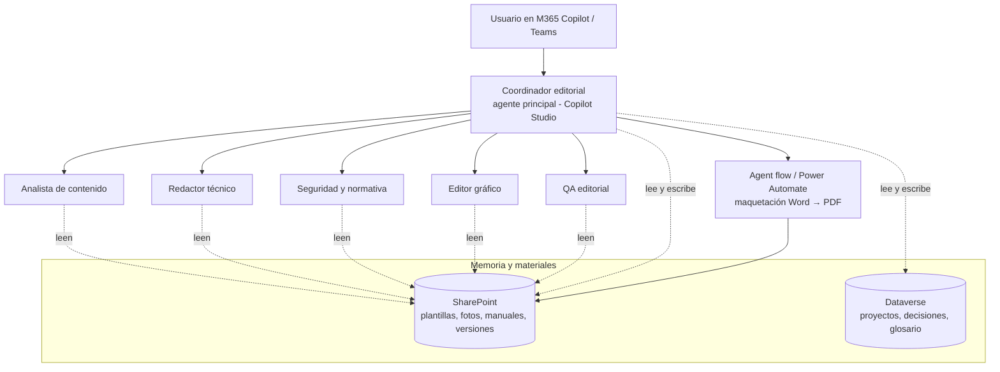

# 02 — Arquitectura en el ecosistema Microsoft

Pregunta a resolver: **¿aplicación a medida u orquestador con subagentes?**
Con la restricción de que todo debe vivir en el entorno Microsoft (privacidad
garantizada) y usarse desde Copilot como herramienta de día a día.

## 1. Opciones evaluadas

### Opción A — Agente declarativo simple (Agent Builder de M365 Copilot)

Un único agente con instrucciones + conocimiento (SharePoint) dentro de M365 Copilot.

- ✅ Cero infraestructura, disponible en Teams/Copilot directamente.
- ❌ Un solo agente monolítico: no soporta un flujo editorial multi-etapa con roles
  diferenciados, ni lógica de proceso (checklist, estados del proyecto), ni
  generación de documentos maquetados.
- **Veredicto: insuficiente** para este caso.

### Opción B — Orquestador + subagentes en Copilot Studio ⭐ (recomendada)

Copilot Studio soporta desde 2025/2026 **orquestación multi-agente**: un agente
principal (nuestro Coordinador editorial) con *connected agents* / agentes hijo a
los que enruta según la tarea. Es exactamente el patrón Neuroforge trasladado a
Microsoft:

- **Coordinador** = agente principal publicado en M365 Copilot y Teams.
- **Subagentes** (redactor, analista, seguridad, gráfico, QA) = agentes conectados,
  cada uno con sus instrucciones y su conocimiento propio.
- **Conocimiento** = sitio SharePoint del proyecto (plantillas, manuales anteriores,
  glosario, materiales subidos). SharePoint indexa PDF/DOCX/PPTX de hasta 512 MB.
- **Memoria estructurada** = tablas Dataverse (proyectos, decisiones, versiones,
  glosario). Copilot Studio ya registra las conversaciones en Dataverse; añadimos
  tablas propias para la memoria de proyecto.
- **Maquetación** = dos vías complementarias:
  1. *Document output* de Copilot Studio (genera Word desde una plantilla con
     campos `{{asi}}`) para entregas sencillas.
  2. **Agent flow / Power Automate + conector de Word** para poblar la plantilla
     corporativa completa (estilos, índices, figuras) y convertir a PDF.
- ✅ Sin código o low-code, gobernanza y privacidad Microsoft, usable desde el
  Copilot del día a día, ampliable (añadir un subagente nuevo = conectar otro agente).
- ⚠️ Requiere licenciamiento de Copilot Studio (mensajes/capacidad) y entorno
  Power Platform con Dataverse.

### Opción C — Aplicación a medida (custom engine agent: Agents SDK / Azure AI Foundry)

- ✅ Control total del razonamiento, modelos a elegir, orquestación programada.
- ❌ Hay que desarrollar, hospedar y mantener la aplicación (Azure), con su coste
  de ingeniería. La propia guía de Microsoft recomienda quedarse en
  declarativo/Copilot Studio salvo que un requisito lo impida.
- **Veredicto: reservar como evolución futura** si Copilot Studio se queda corto
  (p. ej. tratamiento avanzado de imágenes o maquetación InDesign automatizada).

## 2. Arquitectura recomendada (Opción B)

Piezas:

1. **Sitio SharePoint "Manuales Técnicos"** con una biblioteca por proyecto:
   `/<producto>/<manual>/materiales`, `/borradores`, `/versiones`, más una
   biblioteca común de `plantillas` y `glosario`.
2. **Agente principal (Coordinador)** en Copilot Studio, publicado en M365 Copilot
   y Teams. Lleva el guion de entrevista + checklist y decide a qué subagente
   enrutar.
3. **5 agentes conectados** con instrucciones especializadas (las de doc 01).
4. **Tablas Dataverse**: `Proyecto`, `DecisiónEditorial`, `VersiónManual`,
   `TérminoGlosario` (esquema en doc 03).
5. **Agent flow de maquetación**: toma el contenido aprobado y la plantilla
   corporativa Word, rellena campos, inserta imágenes, genera Word + PDF y lo
   deja en `/versiones`.

## 3. Papel de este repositorio GitHub

Este repo es el **código fuente del equipo**: las instrucciones de cada agente,
los checklists normativos, el esquema de memoria y las plantillas de prompts se
versionan aquí en Markdown. Ventajas:

- Podemos **prototipar el equipo completo aquí** (como en Neuroforge, con
  subagentes Claude) para afinar instrucciones y flujo antes de pagarlo/montarlo
  en Copilot Studio.
- Cuando esté afinado, las instrucciones se copian a los agentes de Copilot
  Studio (y se exportan como *solution* de Power Platform para tener también ahí
  control de versiones).

## 4. Preguntas abiertas (a decidir antes de construir)

1. **Licencias**: ¿tenemos Copilot Studio con capacidad de mensajes y un entorno
   Power Platform con Dataverse? (condiciona la parte de memoria estructurada;
   si no, la memoria puede empezar en listas de SharePoint).
2. **Formato final**: ¿el manual definitivo se entrega en Word/PDF corporativo o
   hay maquetación InDesign posterior? (si hay InDesign, el sistema entrega el
   "paquete editorial" — texto + figuras + estructura — y no el PDF final).
3. **Idiomas**: ¿qué idiomas hay que cubrir desde el principio? (activa o no la
   fase 2 del terminólogo/traductor).
4. **Plantilla de partida**: ¿qué manual de ejemplo usamos como patrón para el
   piloto? Idealmente uno reciente y representativo (p. ej. una máquina de café
   o un módulo de pago).
5. **Alcance del piloto**: proponemos empezar con **un tipo de manual** (manual
   de usuario/operación) de **un producto**, y ampliar a instalación,
   mantenimiento y seguridad después.
